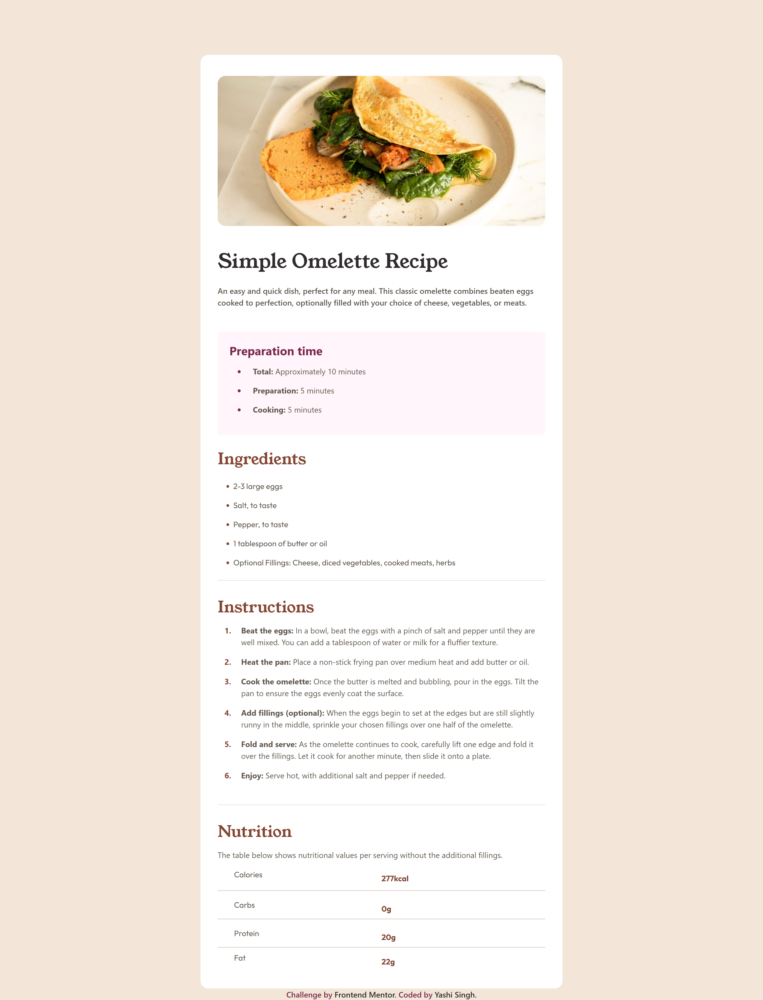
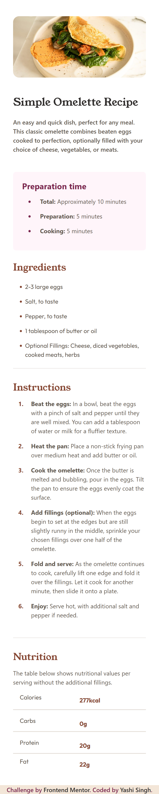

# Frontend Mentor - Recipe Page Solution  
  
  
  
  
  
  
  
[](https://github.com/Yashi-Singh-9/Recipe-Page)  

This is a solution to the [Recipe Page challenge on Frontend Mentor](https://www.frontendmentor.io/challenges/recipe-page-KiTsR8QQKm). Frontend Mentor challenges help you improve your coding skills by building realistic projects.  

---

## Table of contents  

- [Overview](#overview)  
  - [The challenge](#the-challenge)  
  - [Screenshot](#screenshot)  
  - [Links](#links)  
- [My process](#my-process)  
  - [Built with](#built-with)  
  - [What I learned](#what-i-learned)  
  - [Continued development](#continued-development)  
  - [Useful resources](#useful-resources)  
- [Installation & Setup](#installation--setup)  
- [Author](#author)  
- [Acknowledgments](#acknowledgments)  

---

## Overview  

### The challenge  

Users should be able to:  

- View the recipe page with a clean and responsive design  
- See the preparation time, ingredients, instructions, and nutritional values clearly  
- View an image of the dish  

---

### Screenshot  

**Desktop Design**  
  

**Mobile Design**  
  

---

### Links  

- Live Site URL: [Live Site](https://yashi-singh-9.github.io/Recipe-Page/)  

---

## My process  

### Built with  

- Semantic HTML5 markup  
- SCSS (SASS)  
- CSS custom properties  
- Flexbox  
- Bootstrap 5  
- Mobile-first workflow  

---

### What I learned  

Working on this project helped me reinforce my understanding of:  

- **SCSS (SASS)**: Using SCSS for better organization, reusable variables, and cleaner code.  
- **CSS Custom Properties**: Maintaining consistent styling using variables across the project.  
- **Flexbox**: Aligning and distributing space among items in a container.  
- **Responsive Design**: Creating a layout that adapts well to different screen sizes using media queries and Bootstrap.  

---

### Continued development  

In future projects, I aim to:  

- **Explore CSS Grid**: For more complex layouts and design patterns.  
- **Improve Accessibility**: By testing and enhancing the accessibility features of the website.  
- **Incorporate JavaScript**: To add interactive elements and dynamic content.  

---

### Useful resources  

- [SCSS Basics](https://sass-lang.com/guide) - A helpful guide for getting started with SCSS.  
- [CSS Tricks Flexbox Guide](https://css-tricks.com/snippets/css/a-guide-to-flexbox/) - Essential for understanding Flexbox.  
- [Bootstrap Documentation](https://getbootstrap.com/docs/5.3/getting-started/introduction/) - Useful for quickly setting up a responsive layout.  
- [MDN Web Docs on Media Queries](https://developer.mozilla.org/en-US/docs/Web/CSS/Media_Queries/Using_media_queries) - Helpful for implementing responsive design.  

---

## Installation & Setup  

To run this project locally, follow these steps:  

### Prerequisites  

- Ensure you have Node.js and npm installed on your system.  
- Install a SASS compiler like `sass` globally or locally.  

### Installation  

1. Clone the repository:  
   ```bash  
   git clone https://github.com/Yashi-Singh-9/Recipe-Page.git  
   ```  

2. Navigate to the project directory:  
   ```bash  
   cd Recipe-Page  
   ```  

3. Install dependencies (if any for SCSS/Bootstrap workflows).  

4. Compile SCSS:  
   If you are using the `sass` CLI, you can compile SCSS into CSS with the following command:  
   ```bash  
   sass styles.scss styles.css  
   ```  
   To watch for changes:  
   ```bash  
   sass --watch styles.scss:styles.css  
   ```  

---

## Author  

- Frontend Mentor - [@Yashi-Singh-9](https://www.frontendmentor.io/profile/Yashi-Singh-9)  
- LinkedIn - [@Yashi Singh](www.linkedin.com/in/yashi-singh-b4143a246)  

---

## Acknowledgments  

A special thank you to Frontend Mentor for providing this challenge. It was an excellent opportunity to enhance my skills and practice real-world web design techniques. Additionally, a big thank you to MDN Web Docs and CSS Tricks for their comprehensive documentation and tutorials.  